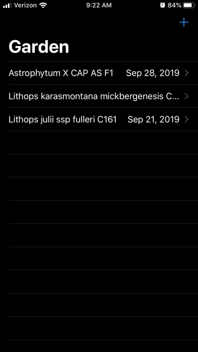

# Germination Tracker

  

author: Joshua Cook  
date: 2019-09-20

*(In development)*

A simple iOS app to track the germination of my seeds.

The following GIF prevides a general summary of the current app.

Third-Party Libraries

* [SnapKit](http://snapkit.io) for setting layout constraints.
* [Chameleon](https://github.com/viccalexander/Chameleon) for some theming (for lower than iOS 13).
* [KeyboardObserver](https://github.com/morizotter/KeyboardObserver) for handling the notifications from the keyboard.
* [SwiftyButton](https://github.com/TakeScoop/SwiftyButton) provides a nice, flat button.